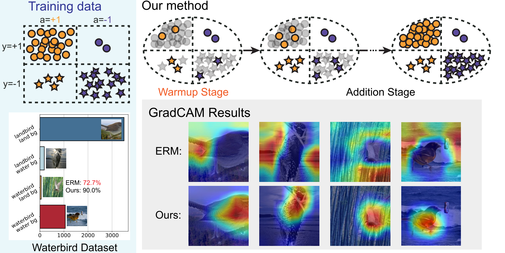

# Robust Learning with Progressive Data Expansion Against Spurious Correlation
This is the official implementation of the paper "Robust Learning with Progressive Data Expansion Against Spurious Correlation" (NeurIPS 2023).

Authors: Yihe Deng*, Yu Yang*, Baharan Mirzasoleiman, Quanquan Gu (* equal contribution)

[[Paper](https://arxiv.org/abs/2306.04949)] 



## Abstract

While deep learning models have shown remarkable performance in various tasks, they are susceptible to learning non-generalizable spurious features rather than the core features that are genuinely correlated to the true label. In this paper, beyond existing analyses of linear models, we theoretically examine the learning process of a two-layer nonlinear convolutional neural network in the presence of spurious features. Our analysis suggests that imbalanced data groups and easily learnable spurious features can lead to the dominance of spurious features during the learning process. In light of this, we propose a new training algorithm called PDE that efficiently enhances the model’s robustness for a better worst-group
performance. PDE begins with a group-balanced subset of training data and
progressively expands it to facilitate the learning of the core features. Experiments on synthetic and real-world benchmark datasets confirm the superior performance of our method on models such as ResNets and Transformers. On average, our method achieves a 2.8% improvement in worst-group accuracy compared with the state-of-the-art method, while enjoying up to 10× faster training efficiency.


## Installation 
```
conda create -n myenv python=3.8
conda activate myenv

(CUDA>=11.1) 
conda install pytorch==1.8.0 torchvision==0.9.0 cudatoolkit=11.1 -c pytorch -c conda-forge
conda install pyg -c pyg
(CUDA==10.0) 
pip install torch==1.8.0 torchvision==0.9.0 torchaudio==0.8.0
pip install torch-scatter torch-sparse torch-cluster torch-spline-conv torch-geometric -f https://data.pyg.org/whl/torch-1.8.0+cu102.html

pip install wilds
pip install transformers[torch]
pip install wandb

conda install -c conda-forge matplotlib
conda install -c anaconda seaborn

pip install opencv-python
```

## Wandb
Wandb is optional for logging and visualization.

To use wandb, you need to create an account at https://wandb.ai/ and login with
```
wandb login
```

Add `--use_wandb` to the command line to enable wandb logging.

## Usage
### Synthetic Dataset
Coming soon

### Waterbirds Dataset
```
python run_expt.py --dataset waterbirds --download --algorithm ERM --model resnet50 --root_dir data --log_dir ./logs --device 0 --lr 1e-2 --weight_decay 1e-2 --subsample --scheduler MultiStepLR --scheduler_multistep_gamma 0.01 --scheduler_kwargs verbose=True --add_start 140 --add_interval 10 --add_num 10 --batch_size 64 --seed 0
```

### CelebA Dataset
```
python run_expt.py --dataset celebA --download --algorithm ERM --model resnet50 --root_dir data --log_dir ./logs --device 0 --lr 1e-2 --weight_decay 1e-4 --subsample --subsample_ref same_across_class --add_start 16 --add_interval 10 --add_num 50 --seed 0
```

### CivilComments Dataset
```
python run_expt.py --dataset civilcomments --download --algorithm ERM --root_dir data --log_dir ./logs --device 0 --subsample --n_epochs 108 --subsample_cap 150 --add_start 15 --add_num 300 --add_interval 2 --seed 0
```

## Citation
If you find this repo useful for your research, please consider citing the paper
```
@inproceedings{robust2023deng,
  title={Robust Learning with Progressive Data Expansion Against Spurious Correlation},
  author={Deng, Yihe and Yang, Yu and Mirzasoleiman, Baharan and Gu, Quanquan},
  booktitle={Advances in Neural Information Processing Systems},
  year={2023}
}
```

## Acknowledgement
This repo is built upon [WILDS](https://github.com/p-lambda/wilds). We thank the authors for their great work.

## Contact
If you have any questions, please contact [Yihe Deng](mailto:yihedeng@cs.ucla.edu) and [Yu Yang](mailto:yuyang@cs.ucla.edu).